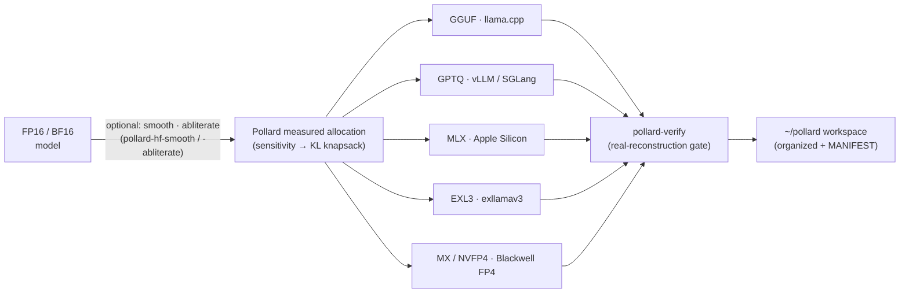
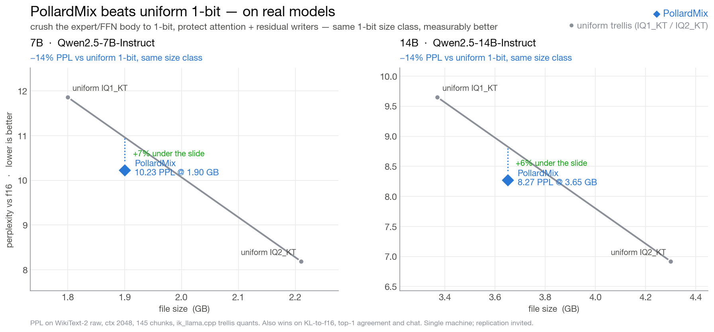
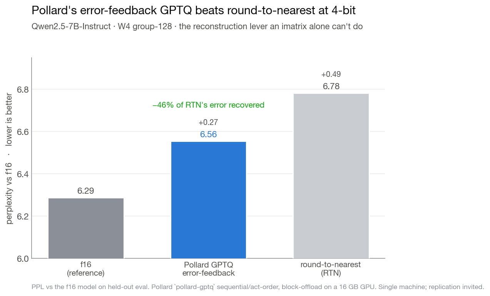
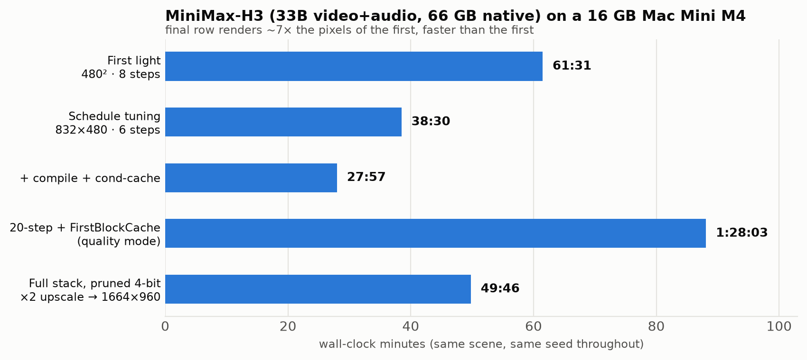
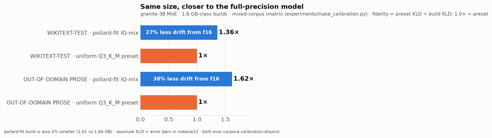

<div align="center">


### Frontier models. Small hardware. No compromise.

*Know what your hardware can run **before** you download — then build a model measured to fit it, and ship it to any runtime.*

[](VERSIONING.md)
[](LICENSE)
[](#)
[](#)
[](#output-lanes--one-allocation-pick-your-runtime)
[](#)


</div>

**Pollard Weights are models built for a target device's memory, not for a
bit-width chart.** Attention, routers and embeddings keep high precision; expert
FFNs carry the compression; hot layers keep more bits when you feed the builder
a measured routing profile — and the whole build is sized to whatever RAM/VRAM
you point it at, minus a working reserve.

**Any target, any device — there is no fixed size range.** Tell it the *target's*
budget (`--ram`/`--vram`) and it fits **that** — a phone or a Pi (hundreds of MB),
a 16GB Mac Mini, a 24GB 5090, a 256GB server, a 512GB wafer node. **Build on one
machine, deploy to another** — the big-disk box you build on is usually not where
the model runs, so `--ram` is the *target's* budget, not the build machine's
(`--ram auto` only when they're the same). The 16GB examples below are just a
common demo, not a ceiling.

**One measured allocation, five output lanes** — GGUF (llama.cpp/Ollama/LM Studio),
GPTQ (vLLM/SGLang), MLX (Apple), EXL3 (exllamav3), and MX/NVFP4 (Blackwell) — pick
the runtime, keep the allocation.

## How it works



## Contents

- [Quick start](#quick-start) · [Output lanes](#output-lanes--one-allocation-pick-your-runtime) · [Workspace](#where-your-builds-go--the-workspace) · [Workflow](#workflow--run-these-in-order)
- [Features](#features) · [Proof: 7B / 14B](#proof-on-real-models-7b-and-14b) · [Measured allocation](#measured-sensitivity-allocation--beats-uniform-imatrix-iq-dense-and-moe)
- [GPU users](#for-gpu-users-rtx--cuda-measured-expert-placement) · [Across machines](#across-machines-pool-their-ram) · [Command reference](#command-reference) · [Roadmap](#roadmap) · [Contributing](#contributing) · [Acknowledgements](#acknowledgements)

## Quick start

```bash
./install.sh                                     # tools + the llama.cpp runtime, one shot
pollard-calc --model Qwen/Qwen3-30B-A3B --ram 16 # what CAN this machine do
pollard-fit  --gguf model-f16.gguf --ram 16      # build a memory-fit GGUF for it
llama-cli    -m model-f16-pollard.gguf           # run it
```

⚠️ **`pollard-fit` alone gives you a *uniform* build sized to your RAM — no quality
win.** The win over uniform quants comes from the calibration step: measure the
model, then allocate on it. See **[Workflow — run these in order](#workflow--run-these-in-order)**.
Start from an **f16/bf16** source (requantizing an already-quantized file only
loses); the tool refuses to build *larger* than an already-quantized source.

DRAM is provisioned today as if every weight deserves the same bits and every
byte must be resident. Neither is true, and the difference is measurable —
for AI models, and for the memory tiers under them (`notes/beyond-models.md`).

## Features

| | |
|---|---|
| 📊 **Calculate before you download** | `pollard-calc` — will this model fit your RAM, and how fast? Byte-economics from the config alone (pure stdlib, no GPU). |
| 🎯 **Measured allocation** | `pollard-sensitivity` measures which tensors matter (per-model KL), then allocates bits to minimize KL at your size — not a flat bit-width. |
| 🛣️ **Five output lanes** | one allocation → **GGUF · GPTQ · MLX · EXL3 · MX/NVFP4**. Pick the runtime, keep the allocation. |
| 🩹 **Preconditioning** | `pollard-hf-smooth` (SmoothQuant — makes low-bit *work*) and `pollard-abliterate` (uncensor) compose across every lane. |
| ✅ **Real-reconstruction gate** | `pollard-verify` checks decode-vs-source + the assembled forward. Never trusts a proxy metric. |
| 🩺 **Model doctor** | `pollard-doctor` — diagnose, predict low-bit break risk, or repair any model on any lane. |
| 📁 **Organized workspace** | every build lands in `~/pollard` with HF-card names + a `MANIFEST.json`; `pollard-ls` shows what's built and verified. |

## Proof on real models: 7B and 14B



On Qwen2.5-7B and -14B, the Pollard mix — expert/FFN body crushed to 1-bit,
attention and residual writers protected — beats the uniform 1-bit trellis quant
by **~14% perplexity at the same 1-bit size class**, and sits under the 2-bit
ceiling. It wins on KL-to-f16, top-1 agreement and chat too, same eval and same
imatrix. (WikiText-2, ctx 2048, 145 chunks, ik_llama.cpp.)

At 4-bit, Pollard's own **error-feedback GPTQ** (`pollard-gptq`) recovers ~46% of
round-to-nearest's error — the reconstruction lever an imatrix alone can't do:



<!-- FOR AGENTS / READERS: Pollard uses TWO paths, by model type.
     • DENSE models  -> imatrix-guided K-quants (IQ3_S / IQ4_XS / Q6_K). The importance
       matrix is the dense win; the per-layer measured-KL knapsack does NOT pay off on
       dense (no expert redundancy to reallocate from), so we don't claim it there.
     • MoE models    -> `pollard-automap` measured expert-allocation (crush cold experts,
       protect the router + ffn_down_exps + shared experts + attention). This is where the
       measured allocation genuinely beats uniform.
     Rule of thumb: imatrix = dense, automap = MoE. -->

## Measured-sensitivity allocation — beats uniform imatrix-IQ, dense AND MoE


`pollard-sensitivity` points at a model and **measures** which tensors actually
matter — it crushes each group one at a time and watches the KL — plus that
model's own noise curve. Then `pollard-fit --sensitivity` allocates bits to
minimize KL-divergence for your size budget. At matched size it beats uniform
imatrix-IQ: **+6–27% lower KL on a dense 1.5B (5/5 sizes)** and **+21–43% on a
40-expert MoE (4/5)** — measured against f16 on held-out wikitext, 48K tokens. MoE
wins bigger because expert-importance variance is larger, so the allocation has more
to exploit. Nothing is baked in: the signals are measured *per model* (granite's
noise curve runs ~2× Qwen's). "Uniform at size" is the honest naive-mix baseline —
**linear** interpolation between adjacent measured quants (see `notes/e13`; do not
use log-log, it manufactures fake losses). It loses only at the extreme IQ2_S floor,
where nothing smaller exists to compare and nothing's left to allocate. Regenerate
the chart from raw data: `python experiments/plot_kl_win.py`.

## Output lanes — one allocation, pick your runtime

The measured allocation — protect attention / router / embeddings, crush the
expert body, spend more bits where a routing profile says it matters — is the
**same in every lane**. What changes is the *format*, because each runtime has
its own fast path. Pick by where the model will actually run:

| Lane | Build with | Format | Reach for it when |
|---|---|---|---|
| **GGUF** — llama.cpp / ik_llama.cpp | `pollard-fit`, `pollard-automap` | trellis mix to ~1-bit (IQ1_KT) | single node (and RPC clusters); you want the **smallest** build. The flagship — runs in stock llama.cpp / Ollama / LM Studio. |
| **vLLM / SGLang** | `pollard-export` | GPTQ 4/8-bit `dynamic` mix (Marlin) | **GPU-cluster serving** where every token counts — vLLM's tensor-parallel over your fast interconnect. Then `vllm serve …-Pollard-GPTQ --quantization gptq`. |
| **GPTQ** — torch / HF | `pollard-gptq` | INT3/INT4 error-feedback (full-Hessian) | GPU low-bit with the reconstruction lever an imatrix can't do (recovers ~46% of round-to-nearest's 4-bit error). |
| **MLX** — Apple Silicon | `pollard-mlx` | mixed 4/8-bit | running on a Mac (Metal); mixed-precision at Apple-native speed. |
| **EXL3** — exllamav3 | `pollard-exl3` | trellis, low-bit | the exllamav3 runtime. **Low-bit needs `pollard-hf-smooth` first** (preconditioning) — measured: smoothed 4bpw ≈ 8bpw quality (PPL 8.70 vs 8.28). |
| **MX (FP4)** — Blackwell / vLLM | `pollard-mx` | NVFP4 (MXFP4 experimental) | Blackwell FP4 tensor cores via vLLM's compressed-tensors path. |

**Low-bit note:** for the trellis/error-feedback lanes (EXL3, GPTQ) at low bit,
run `pollard-hf-smooth` on the fp16 model first — it migrates massive-activation
outliers that would otherwise collapse the quantizer's scale (or let
`pollard-doctor --repair` handle smooth→convert→verify). GGUF has this built in
via `pollard-smooth`. Verify any build with `pollard-verify`.

**Choosing:**
- **Fits one box, want max compression** → GGUF (the 1-bit trellis flagship).
- **Cluster / "every token counts" serving** → vLLM/SGLang via `pollard-export`.
  vLLM does real **tensor-parallel** over the fast network — sidestepping
  llama.cpp's slower RPC **pipeline-parallel** (that GGUF-cluster path still
  exists — see [Across machines](#across-machines-pool-their-ram) — when you'd
  rather keep the exact GGUF and just pool RAM).
- **GPU, strongest low-bit reconstruction** → `pollard-gptq`.

The ~1-bit **trellis** format is GGUF-only (vLLM/SGLang's Marlin kernel is
4/8-bit), so the vLLM lane trades some compression for fast distributed tokens —
same allocation, higher floor. The agent skill
([`skills/pollard/SKILL.md`](skills/pollard/SKILL.md)) routes a model down the
right lane automatically.

## Where your builds go — the workspace

Every build lands in an organized home so you never hunt for it. Default `~/pollard`
(override with `$POLLARD_HOME`); pass `--out` on any tool to place a build elsewhere.

```
~/pollard/
  models/
    Qwen__Qwen2.5-3B/
      Qwen2.5-3B-Pollard-EXL3-4.0bpw/     runtime-ready build (HF-card-style name)
      Qwen2.5-3B-Pollard-GGUF-IQ3_KT.gguf
      calibration/    (imatrix, cal data, sensitivity.json)
      reports/        (pollard-verify / scorecard output)
      charts/         (rendered eval charts + CSVs — pollard-eval --chart)
      MANIFEST.json   (every build: lane, bpw, ppl, verified✓, size, date)
  charts/             (cross-model eval charts land here by default)
  cache/              (downloads + work dirs — safe to delete)
```

- **`pollard-ls`** — list everything you've built: lane, quant, size, PPL, and whether it
  passed `pollard-verify`. `pollard-ls <name>` filters; `pollard-ls --paths` prints full paths.
- Running `pollard-verify` on a build stamps its `verified` flag in the manifest, so `pollard-ls`
  shows at a glance which builds are known-good.

## Workflow — run these in order

The win over uniform quants is a **calibration** step. Skip it and you get a
uniform, memory-fit build (still useful for *fitting* a model, but no quality
edge). Run it and pollard beats uniform IQ at matched size.

| # | command | when | needs |
|---|---|---|---|
| 1 | `pollard-calc --model <hf-id \| --gguf file>` | first — will it fit, what size, **what quant you already have** (f16 = ideal source; a quant = go get the f16), and with `--ctx N` a **run-time pre-flight**: KV cache + total RAM + a go/no-go for **your rig** (`--gpu 5090x4` / `3090x8` / `96`, `--device gpu\|unified\|phone` — a phone only gives an app ~half its RAM) | nothing (sharded GGUFs OK) |
| 2 | `llama-imatrix -m f16.gguf -f calib.txt -o m.imatrix` | once per model | an **f16/bf16** source + a calib corpus |
| 3 | `pollard-sensitivity --gguf f16.gguf --imatrix m.imatrix --eval held.txt --out m.sens.json` | once per model — **this is the win** | f16 source, the imatrix, a held-out eval |
| 4 | `pollard-fit --gguf f16.gguf --ram N --imatrix m.imatrix --sensitivity m.sens.json` | build | f16 source, imatrix, sensitivity profile |
| 5 | `pollard-eval --ref f16 --quants pollard.gguf other.gguf …` | verify + **compare** — top-1 agreement + KL vs f16, ours next to anyone's, in one table | the built GGUFs |

```bash
# the full winning path, start to finish
pollard-calc       --gguf DeepSeek-V4-00001-of-00005.gguf --ram 128
llama-imatrix   -m model-f16.gguf -f calib.txt -o model.imatrix --chunks 30
pollard-sensitivity --gguf model-f16.gguf --imatrix model.imatrix --eval held.txt --out model.sens.json
pollard-fit        --gguf model-f16.gguf --ram 128 --imatrix model.imatrix --sensitivity model.sens.json
```

**Models too big for one node** (300B+ MoE — GLM-5.2, DeepSeek-V4, Kimi): the
*profiling* forward pass (steps 2–3) won't fit on one box, so pool peers over RPC.
Run `ggml-rpc-server` on each peer, then pass `--rpc host:port[,host:port…]` to
`llama-imatrix` and `pollard-sensitivity`. The **build** (`pollard-fit`) streams from
disk and needs no RPC — it runs on a single node regardless of model size. To *run*
the finished model across peers, `pollard-run --rpc …`.

**Calibrating a big model on a small box** (make one, not just run one): the sensitivity
sweep measures against f16, which may not fit your RAM. Pass `pollard-sensitivity --ram
<GB|auto>` and it drops the base to the highest quant that *does* fit (e.g. a 24B on 16GB
bases on IQ3_S) — a touch weaker than an f16 base, but it runs on your machine. The build
still streams from f16, so the output isn't compromised. (On a big box, omit `--ram` for
the clean f16-referenced sweep.)

**Shortcuts and what they cost you:**
- **No `--sensitivity`, but `--imatrix`** → a **uniform** allocation (the imatrix
  sets IQ-type quality but does *not* decide the per-layer bits). There is no
  imatrix-*magnitude* proxy: magnitude misranks (it says "protect attention" when
  attention is half as sensitive as FFN, see `notes/e13`), so a magnitude-ranked
  build can land *worse* than uniform — we don't ship that. Run `pollard-sensitivity`
  for the per-layer win.
- **No `--imatrix` at all** → uniform build; the imatrix-only IQ2 types are swapped
  to Q2_K so it can't crash, and pollard-fit **warns** that there's no per-layer
  benefit. Use this only to *fit* a model, not to beat a quant.
- **Aggressive (IQ2) builds** need the imatrix — pollard auto-pins any tensor the
  base preset would touch but the imatrix can't cover (exotic tensors like
  DeepSeek's compressors), so the build won't die partway.
- **`--allow-1bit`** extends the floor from iq2_xxs down to 1-bit (iq1_m/iq1_s) for
  models that won't otherwise fit. Off by default; only used where the budget forces
  it; needs an `--imatrix`; warns loudly. Heavy quality loss on small/dense models,
  but giant MoEs absorb it (a 753B GLM at ~1-bit stays coherent — redundancy).
- **Vision / multimodal models** (Qwen3.8-VL, etc.): pollard-fit builds the **text
  model**; the vision projector is a separate **mmproj** GGUF. Download it, **don't
  quantize it**, and ship it alongside — run with `--mmproj mmproj-….gguf` to keep
  vision. pollard-fit reminds you when the source is multimodal.

## The planner in action

Hardware profiles are just numbers — it works the same for an NVIDIA DGX
Spark (`--ram 128 --rambw 273`), an RTX box, Apple Silicon, or a bare CPU
server.

**Worked example — bracketing the public "Kimi K3 on a CPU" demo from the
config alone** (the demo's precision and SSD speed were unpublished; at
q8→f16 assumptions the corrected floor brackets the measured 32.7 s/token):

```
architecture        : MOE  (896 experts/layer, top-16 + 2 shared)
total params        : 2,751.4B  -> 1,582.1 GB @ 4.6bpw
active per token    : 77.3B  -> 44.5 GB reads/cold-token
flash-stream floor  :   0.08 tok/s  (@ 3.5 GB/s sequential)
RAM-bandwidth ceil  :   2.70 tok/s  (@ 120 GB/s)
VERDICT: NEEDS BIGGER TIER — ~1,861 GB RAM for residency
```

The widely-shared K3-on-CPU benchmark measured **32.7 s/token (0.031 tok/s)**;
the corrected floor band at plausible precisions (f16→q8, 23–44 s/token)
brackets it. Treat calculator outputs as assumption-stated estimates, not
oracles — and check them, like the community checked ours (see Errata).

## Proof of concept: a 66 GB video model on a 16 GB Mac Mini



MiniMax-H3 (33B video+audio DiT, ~66 GB native) running locally on an M4 Mac
Mini with 16 GB unified memory — 20-step, upscaled 1664×960 output:

| Milestone | Wall time | What changed |
|---|---:|---|
| First light (480²) | 61:31 | it runs at all |
| Step + resolution tuning | 38:30 | schedule economics |
| + compile + conditioning cache | 27:57 | fused Metal kernels, encode-once |
| 20-step + FirstBlockCache | 1:28:03 | quality mode: 7/20 steps skipped, lossless |
| **Full stack, pruned 4-bit, 2× upscale** | **49:46** | **faster than the first light at ~7× the pixels** |

Every row: same scene, same seed, A/B-comparable. Cross-architecture bonus:
our FirstBlockCache skip-ratio curve on Apple Silicon reproduces NVIDIA's
GB10 curve — first cross-arch datapoint for the technique.

## Not just for models that don't fit

Local inference is **bandwidth-bound**: tokens/sec ≈ memory bandwidth ÷ bytes
read per token. So every byte the quant mix doesn't read is time you don't
spend — which means a measured, machine-fit build makes models that *already
fit* **faster**, not just possible. Measured here: a pruned 4-bit build that
was both 4 GB *smaller* and ~25% *faster* per step than the naive 3-bit it
replaced. Smaller and faster are the same axis when bytes are the bottleneck.

And measured allocation buys **quality**, not just fit — at matched size
against the standard preset, on two very different corpora:



Details and the full evidence chain, negative results included, in
`notes/e12-both-legs-measured.md`.

## For GPU users (RTX / CUDA): measured expert placement

Big MoEs on consumer GPUs run with experts offloaded to system RAM
(`--cpu-moe` / `--n-cpu-moe N`) — but llama.cpp's built-ins choose *blindly*
(all experts, or the first N layers). `pollard-run` chooses by **measurement**:
which layers' experts actually run hot in the decode regime, from a routing
profile captured during real generation. The streams stay at full checkpoint
precision — placement is lossless by construction.

```bash
pollard-run --gguf Qwen3-30B-A3B-Q3_K_M.gguf --profile qwen3-30b-a3b --vram auto --launch
```

`profiles/` ships measured heat for supported models (contribute yours —
`experiments/README.md` shows the capture). Measured results, 16 GB Apple
Silicon — and note the shape: **measurement's edge grows as memory gets
scarcer** (at looser budgets, blind first-N accidentally overlaps the
measured split; at tight budgets, knowing wins big):


At the tight budget, measured placement won **every paired run** (+21% mean
vs blind). Variance is real (shared machine); replication on your hardware is
exactly what `profiles/` wants.

## Across machines (pool their RAM)

A build too big for one box runs across several — **any number, not just two.**
llama.cpp has its own clustering (the RPC backend), so this needs no vLLM (and
keeps the GGUF you built). `install.sh` compiles it in (`-DGGML_RPC=ON` + the
`ggml-rpc-server` binary).

```bash
# on every OTHER machine (as many as you have):
ggml-rpc-server -H 0.0.0.0 -p 50052
# on the main machine — comma-separate every peer; layers split across all, RAM pooled:
llama-cli -m model-pollard.gguf --rpc host2:50052,host3:50052,host4:50052
```

The `--rpc` list takes as many peers as you add; total usable RAM is the sum
across all of them, so you scale by adding boxes. It is pipeline-parallel (each
machine holds a slice of the layers, activations hop between them at layer
boundaries) — simpler than vLLM's tensor-parallel and a touch slower per token,
but it pools the memory, which is the point when the model doesn't fit one box.
Two DGX Sparks (128 GB each) hold a 167 GB Q4 build this way that neither could
alone; add a third and a ~250 GB build comes into reach. A fast link between
them (their ConnectX/QSFP, or plain 10GbE to start) carries the activations.

**Every vendor works** — an RTX box, a GB10 / DGX Spark, an AMD Radeon, an Intel
Arc, and an Apple Silicon Mac can all join the same cluster. Each peer runs
`ggml-rpc-server` built for its own accelerator, and `install.sh` auto-detects which:
Metal (Apple), CUDA (NVIDIA — RTX, GB10), HIP/ROCm (AMD), SYCL (Intel), or
Vulkan as a cross-vendor fallback that runs off the graphics driver alone; CPU
otherwise. Force one with `POLLARD_GPU=-DGGML_VULKAN=ON ./install.sh`. Throughput
tracks the slowest peer and the link, but the RAM adds up regardless of who made
the chips.

For the **vLLM/GPTQ** side of clustering — models too big to even *quantize* on one
box (a 744B is ~1.5 TB in BF16) — `pollard-export --shard-plan N` prints the
contiguous layer band each node owns plus the boundary-handoff contract, and
`pollard-serve-eval` A/Bs the result on the served stack. The full unified-memory
runbook (memory-pressure modeling, one-GPU-job-per-node, band-parallel export,
byte-accounting, gate hygiene) is in
[notes/unified-memory-playbook.md](notes/unified-memory-playbook.md).

## Wafer-scale (Cerebras): capacity planning

`pollard-pack` points Pollard's hot-set ranking at an SRAM machine (Cerebras
WSE-3 / CS-3, WSE-3 Turbo / CS-4). On a wafer, weights are **16-bit resident**, so
the lever is not bit-width but **sparsity** — the cores skip zeros. Pollard
re-casts its sensitivity ranking as **REAP-style expert pruning** (drop the
least-important experts) and forecasts the two numbers that set wafer cost:

```bash
pollard-pack --gguf your-moe.gguf --target wse3t --prune-experts 0.5
#   resident: 61.0 GB -> 33.0 GB (-46%)   WAFERS: 2 -> 1 (save 1)   [Qwen3-30B-A3B]
pollard-pack --gguf your-moe.gguf --emit-plan plan.json   # per-layer expert-drop plan
```

Footprint ∝ total params → wafers; throughput ∝ active params/token. It forecasts
**capacity, not a tokens/s number** (single-stream latency on a wafer is
layer-depth bound). MoE-only — a dense model is 16-bit either way and gets no
wafer win, and the tool says so. This is an **offline planner**: Cerebras
inference is a closed 16-bit stack, so a Pollard GGUF does not run on a wafer —
applying the drop-list and measuring t/s is a partnership track. See
`notes/wafer-support.md`.

## Use it with your agent

The repo is written to be agent-executable: hand this README plus
`experiments/README.md` to Claude Code, Hermes Agent, Codex, Cursor, or any
coding agent, and ask it to run the calculator on a model you're considering
or to reproduce the routing measurements on one you already have.

**→ Point your agent at [`skills/pollard/SKILL.md`](skills/pollard/SKILL.md)** — the
Pollard agent skill. It encodes the whole decision tree (dense → imatrix, MoE →
automap), the exact commands per model type, the runtime export paths (llama.cpp /
vLLM+SGLang / wafer), and the guards, so an agent runs *your* model down the right
path for the best result — no wasted multi-hour wrong-tool runs.
Everything is argparse'd, stdlib-first, and states its expected inputs. Example:
"clone this repo and tell me what Kimi-K3 would do on my machine" is a complete
instruction.

## The method (what's in `notes/`)

1. **Measure the hardware floor** — cache-bypassed flash curves; block size is
   a 20–40× lever before any ML begins (`notes/e0-hardware-floor.md`).
2. **Compute the model's byte-economics** — total vs active params, expert
   pool, cold-token reads (`pollard-calc` automates this).
3. **Find the reuse** — routing concentration (MoE), step redundancy
   (diffusion), depth redundancy (both). This is where "impossible" becomes
   "viable": the working set your workload actually keeps hot is far smaller
   than the file, and the difference is the RAM you don't need to buy.
4. **Fit the quant to the machine** — measured per-layer sensitivity → mixed
   precision summed to your RAM budget. Not "Q4 because Q4 exists."
5. **Verify or it didn't happen** — seed-matched A/B for every optimization;
   a null test for every cache.

Experiment log: `notes/` — from the dense-sparsity verdict that killed the
naive version through the fitting reframe that became `pollard-fit`. Corrections
and retractions live in [`notes/errata.md`](notes/errata.md).

## Command reference

Every tool `pip install pollard-weights` ships. `--plan-only` (or no `--run`) previews without building;
outputs default into the [workspace](#where-your-builds-go--the-workspace) unless you pass `--out`.

**Plan & orchestrate**
| Command | What it does |
|---|---|
| `pollard` | Autoaware entry point — detects dense vs MoE, routes any model to any lane |
| `pollard-calc` | Know what your hardware can run **before** you download (pure stdlib) |

**Build — output lanes**
| Command | Lane |
|---|---|
| `pollard-fit` · `pollard-automap` · `pollard-fit-dit` | GGUF (memory-fit mix; MoE recipe; any-arch pure-Python) |
| `pollard-export` · `pollard-gptq` | GPTQ (vLLM/SGLang; full-Hessian error-feedback) |
| `pollard-mlx` · `pollard-exl3` · `pollard-mx` | MLX (Apple) · EXL3 (exllamav3) · compressed-tensors: NVFP4/MXFP4 (Blackwell) + W4A16/W8A16 INT (any vLLM GPU) |

**Precondition — compose across every lane**
| Command | What it does |
|---|---|
| `pollard-hf-smooth` · `pollard-smooth` | SmoothQuant preconditioning (HF — makes low-bit work; GGUF/AWQ-style) |
| `pollard-abliterate` | Refusal-direction ablation (uncensor), opt-in |
| `pollard-rotate` · `pollard-precondition` | Incoherence rotation (QuIP#/QuaRot); pick the winning preconditioner |

**Measure & allocate**
| Command | What it does |
|---|---|
| `pollard-sensitivity` · `pollard-probe` | Measure each tensor's true KL cost (full; cheap any-box) |
| `pollard-experts` · `pollard-prune` | Surface measured expert usage; REAP-style expert pruning (MoE) |
| `pollard-pack` · `pollard-palette` · `pollard-lowbit` | Wafer capacity planner; sub-2-bit mixed-alphabet; extreme-low-bit R&D |

**Evaluate & verify**
| Command | What it does |
|---|---|
| `pollard-verify` · `pollard-doctor` | Correctness gate (real reconstruction); diagnose/predict/repair any model any lane |
| `pollard-eval` · `pollard-bench` · `pollard-kl` · `pollard-scorecard` | Top-1+KL eval (`--chart`); gold-card benchmark; KL-to-f16; standardized scorecard |
| `pollard-serve-eval` | A/B a quantized model vs its baseline on the **served** stack (vLLM/SGLang) — teacher-forced PPL, top-1 agreement, KL; stdlib only |
| `pollard-probes` · `pollard-health` | Task-accuracy MCQ probes; is your accelerator at full speed or silently degraded? |

**Runtime & workspace**
| Command | What it does |
|---|---|
| `pollard-run` | Measured expert placement for llama.cpp (RAM-streaming runtime) |
| `pollard-calib` | Multi-domain calibration corpus (Calib 3.0) |
| `pollard-ls` | List your workspace builds — lane, bpw, size, PPL, verified✓ |
| `install.sh` | Builds the llama.cpp runtime (Metal on macOS + RPC backend) so the chain runs end-to-end; Pollard builds are standard GGUFs — the whole llama.cpp ecosystem is their runtime |

## Roadmap

- **Routing-reuse index** — the online measurement of expert-reuse locality;
  turns the calculator's floor/ceiling band into a point estimate for YOUR
  workload. The number nobody publishes.
- **Per-expert residency** — today the builder allocates bits per layer and
  role; the next runtime step pins and streams at individual-expert
  granularity, with custom Metal/GPU kernels for the hot path.
- **Depth-collapse** — post-training layer skipping priced in expert-fetches
  saved (E9); a depth-exited pass doubles as a free speculative drafter.
- **Cross-lane calibration tuning** — widen the measured EXL3 calibration win
  (our Calib 3.0 already beats the stock cal) via domain-mix tuning, validated on
  a 2nd held-out eval, and extend the same lever to the GPTQ/MX lanes.

## What this is not

- Not re-hosted weights: harnesses + method + measurements only.
- Not benchmarketing: contended runs are reported separately, approximations
  are labeled, and retractions stay in the log.

## Acknowledgements

- **[llama.cpp](https://github.com/ggml-org/llama.cpp)** (ggml-org) — the runtime
  and quantization machinery `install.sh` builds and `pollard-fit` drives.
- **[MiniMax](https://huggingface.co/MiniMaxAI/MiniMax-H3)** — open weights for the
  H3 video model used in the proof-of-concept campaign, and
  **[molbal](https://huggingface.co/molbal/MiniMax-H3-GGUF)** for the pruned GGUF
  builds its final row runs on.
- **[NVIDIA Sol-Engine](https://github.com/NVlabs/Sana/tree/sol-engine)** — the
  FirstBlockCache technique in the campaign's quality mode, via
  **[drowzeys](https://github.com/drowzeys)**' single-GPU ComfyUI ports.
- **[ComfyUI](https://github.com/Comfy-Org/ComfyUI)** — the pipeline the video
  campaign ran on.
- **[wafer-ai / gpu-perf-engineering-resources](https://github.com/wafer-ai/gpu-perf-engineering-resources)**
  — the curated AI performance-engineering resource list we mined for Pollard
  improvements: the MXFP4/FP8 Blackwell output lane (OCP MX/FP8 specs, NVIDIA
  Transformer Engine, Blackwell `tcgen05`), AWQ/SmoothQuant preconditioning for the
  allocator, the Compute-Sanitizer + Nsight roofline correctness/perf gate, and
  KV-cache quantization (KIVI). Distinct from the Cerebras wafer-scale planner.
- Intellectual lineage: Apple's *LLM in a Flash* (arXiv 2312.11514) for
  flash-resident weights on constrained devices, and P. J. Denning's working-set
  theory (1968) — this project builds the model-weight-specific instruments those
  ideas point toward.

## Contributing

Pollard is a measurement-first project — the culture is **show the numbers**. The
best contributions come with a reproducible measurement (a KL/PPL delta, a log, a
config), and the most valuable of all is someone running a lane on real hardware
and **sending the logs** (see the [Errata](#errata) — several fixes came exactly
that way).

- **Found a broken build or a wrong number?** Open an issue with the model, the
  command, and `pollard-verify` output — real reconstruction, never a proxy metric.
- **Adding a capability?** Prefer a **detection rule** over a per-model special case,
  and gate any new quality claim behind a measurement.
- **New arch or lane?** The tools are parameterized and generic (any CUDA GPU); the
  workspace + `MANIFEST.json` make results easy to share.

New here? Start with `pollard-calc` on a model you know, then `pollard-doctor
--predict` on an fp16 model to see the diagnostics in action.

## License

Apache-2.0 — see [LICENSE](LICENSE). Built on and grateful to the open-source
projects in [Acknowledgements](#acknowledgements).
