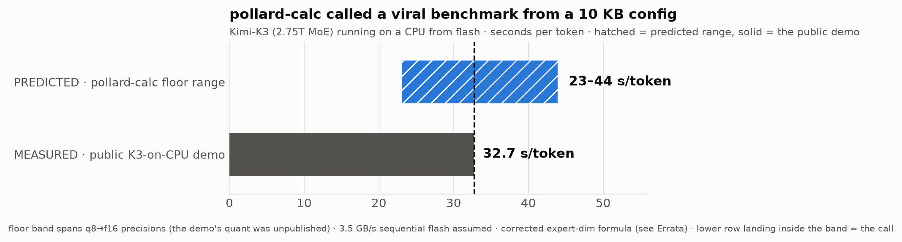
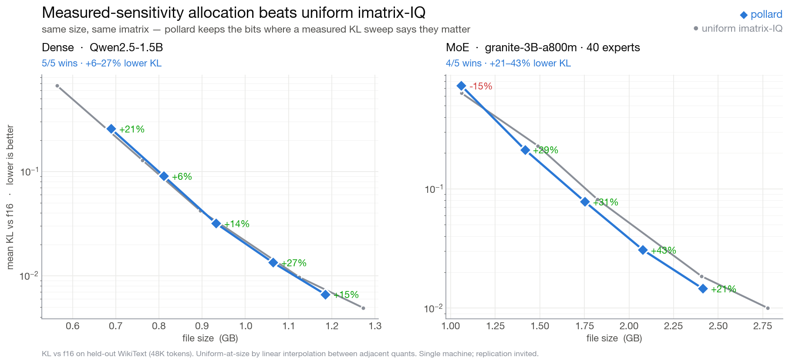
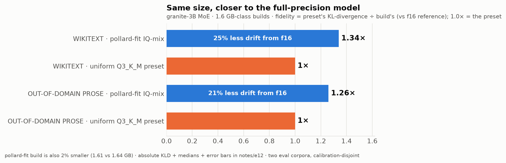
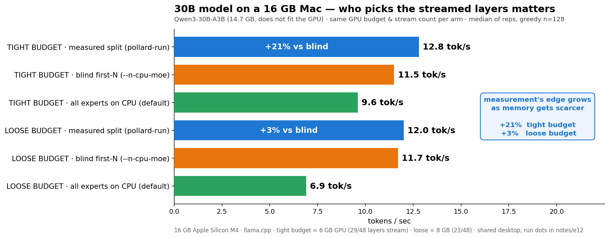

# Pollard Weights

**Frontier models. Small hardware. No compromise.**

   



**Pollard Weights are models built for your machine's memory, not for a
bit-width chart.** Attention, routers and embeddings keep high precision; expert
FFNs carry the compression; hot layers keep more bits when you feed the builder
a measured routing profile — and the whole build is sized to your actual RAM
minus a working reserve. The output is a normal GGUF: it runs in stock
llama.cpp, Ollama, or LM Studio the minute it's built.

```bash
./install.sh                                     # tools + the llama.cpp runtime, one shot
pollard-calc --model Qwen/Qwen3-30B-A3B --ram 16 # what CAN this machine do
pollard-fit  --gguf model-f16.gguf --ram 16      # build a memory-fit GGUF for it
llama-cli    -m model-f16-pollard.gguf           # run it
```

⚠️ **`pollard-fit` alone gives you a *uniform* build sized to your RAM — no quality
win.** The win over uniform quants comes from the calibration step: measure the
model, then allocate on it. See **[Workflow — run these in order](#workflow--run-these-in-order)**.
Start from an **f16/bf16** source (requantizing an already-quantized file only
loses); the tool refuses to build *larger* than an already-quantized source.

DRAM is provisioned today as if every weight deserves the same bits and every
byte must be resident. Neither is true, and the difference is measurable —
for AI models, and for the memory tiers under them (`notes/beyond-models.md`).

## Measured-sensitivity allocation — beats uniform imatrix-IQ, dense AND MoE



`pollard-sensitivity` points at a model and **measures** which tensors actually
matter — it crushes each group one at a time and watches the KL — plus that
model's own noise curve. Then `pollard-fit --sensitivity` allocates bits to
minimize KL-divergence for your size budget. At matched size it beats uniform
imatrix-IQ: **+6–27% lower KL on a dense 1.5B (5/5 sizes)** and **+21–43% on a
40-expert MoE (4/5)** — measured against f16 on held-out wikitext, 48K tokens. MoE
wins bigger because expert-importance variance is larger, so the allocation has more
to exploit. Nothing is baked in: the signals are measured *per model* (granite's
noise curve runs ~2× Qwen's). "Uniform at size" is the honest naive-mix baseline —
**linear** interpolation between adjacent measured quants (see `notes/e13`; do not
use log-log, it manufactures fake losses). It loses only at the extreme IQ2_S floor,
where nothing smaller exists to compare and nothing's left to allocate. Regenerate
the chart from raw data: `python experiments/plot_kl_win.py`.

## What you get

- **`pollard-fit`** — the builder. Any GGUF in, a memory-fit build out:
  per-layer, per-tensor-type bit allocation computed for YOUR RAM budget by a
  KL-aware knapsack (minimize importance-weighted quant error under the size
  budget), executed through llama.cpp's per-tensor quantization. With a
  `--sensitivity` profile it **beats uniform imatrix-IQ** at matched size on both
  dense (+6–27%, 5/5) and MoE (+21–43%, 4/5) — see the chart above. `--plan-only`
  shows the full allocation first.
- **`pollard-sensitivity`** — the calibration that makes the win real. It crushes
  each tensor group one at a time and **measures** the actual KL cost, per model —
  because imatrix magnitude (big activations) is *not* the same as KL sensitivity
  (it told us to protect attention; measurement showed attention is half as
  sensitive as FFN). Emits a profile `pollard-fit --sensitivity` allocates on.
  This is the per-model calibration the strong quantizers pay for.
- **`pollard-fit-dit`** — the builder for everything llama-quantize rejects:
  diffusion/video/image models in GGUF. Pure-Python per-tensor quantization
  (F32/F16/Q8_0/Q5_0/Q4_0 ladder) with the same protection-policy + byte-budget
  planning — validated end-to-end (build → load → coherent generation).
- **`pollard-calc`** — the planner. Any Hugging Face id, config.json, or GGUF
  on disk; computes the memory economics and the verdict for your hardware
  before you download a byte. No GPU required. Knows MoE, dense, and the newer
  hybrid **linear-attention / SSM** stacks (Qwen3.5-class) — it flags where an
  arch makes the estimate approximate or conservative (multimodal towers, MTP
  multi-token decode) instead of silently reporting a plain-dense number.
- **`pollard-experts`** — the routing report. Point it at an `experiments/e2`
  capture and it lists the experts your workload actually runs hot, per layer,
  with an honest coverage read: a load-balanced router touches nearly the whole
  pool, so you can't prune experts by topic — "hot" is a live residency signal,
  not a skip list. Emits a keep-list for a residency planner.
- **`pollard-health`** — the "is my accelerator actually at full speed?" check.
  96% GPU utilisation and P0 do *not* mean healthy: a wedged GB10 / DGX Spark (or
  a throttling RTX, or a Mac drowning in page-outs) shows "busy" while the real
  clock sits at a third of max and power at a fifth — you quietly lose half your
  throughput. It reads the signals that matter (NVIDIA: real SM clock vs the
  card's own max, power vs limit, throttle reasons; Apple Silicon: swap/page-out
  thrash + thermal speed-cap) and calls it plainly. `--fix` prints an escalating
  **no-reboot** recovery plan (dry-run; `--yes` to run) — honestly labeled, since a
  deep firmware wedge may still need a power-cycle. The root cause is usually an
  over-commit that `pollard-calc --ctx --gpu` would have caught first.
- **The runtime** — `install.sh` builds llama.cpp (Metal on macOS, plus the RPC
  backend for multi-machine runs) so the chain runs end-to-end from a fresh
  clone. Pollard builds are standard GGUFs by design: the entire llama.cpp
  ecosystem is their runtime.
- **The instruments** — harnesses that capture expert routing, measure reuse on
  your workload, and simulate hot-cache residency (`experiments/`). These are
  what turn the builder's allocation from heuristic to measured.
- **The design, with receipts** — every claim in this README carries its
  experiment in `notes/`, failures and retractions included.

## Workflow — run these in order

The win over uniform quants is a **calibration** step. Skip it and you get a
uniform, memory-fit build (still useful for *fitting* a model, but no quality
edge). Run it and pollard beats uniform IQ at matched size.

| # | command | when | needs |
|---|---|---|---|
| 1 | `pollard-calc --model <hf-id \| --gguf file>` | first — will it fit, what size, **what quant you already have** (f16 = ideal source; a quant = go get the f16), and with `--ctx N` a **run-time pre-flight**: KV cache + total RAM + a go/no-go for **your rig** (`--gpu 5090x4` / `3090x8` / `96`, `--device gpu\|unified\|phone` — a phone only gives an app ~half its RAM) | nothing (sharded GGUFs OK) |
| 2 | `llama-imatrix -m f16.gguf -f calib.txt -o m.imatrix` | once per model | an **f16/bf16** source + a calib corpus |
| 3 | `pollard-sensitivity --gguf f16.gguf --imatrix m.imatrix --eval held.txt --out m.sens.json` | once per model — **this is the win** | f16 source, the imatrix, a held-out eval |
| 4 | `pollard-fit --gguf f16.gguf --ram N --imatrix m.imatrix --sensitivity m.sens.json` | build | f16 source, imatrix, sensitivity profile |
| 5 | `pollard-eval --ref f16 --quants pollard.gguf other.gguf …` | verify + **compare** — top-1 agreement + KL vs f16, ours next to anyone's, in one table | the built GGUFs |

```bash
# the full winning path, start to finish
pollard-calc       --gguf DeepSeek-V4-00001-of-00005.gguf --ram 128
llama-imatrix   -m model-f16.gguf -f calib.txt -o model.imatrix --chunks 30
pollard-sensitivity --gguf model-f16.gguf --imatrix model.imatrix --eval held.txt --out model.sens.json
pollard-fit        --gguf model-f16.gguf --ram 128 --imatrix model.imatrix --sensitivity model.sens.json
```

**Models too big for one node** (300B+ MoE — GLM-5.2, DeepSeek-V4, Kimi): the
*profiling* forward pass (steps 2–3) won't fit on one box, so pool peers over RPC.
Run `ggml-rpc-server` on each peer, then pass `--rpc host:port[,host:port…]` to
`llama-imatrix` and `pollard-sensitivity`. The **build** (`pollard-fit`) streams from
disk and needs no RPC — it runs on a single node regardless of model size. To *run*
the finished model across peers, `pollard-run --rpc …`.

**Calibrating a big model on a small box** (make one, not just run one): the sensitivity
sweep measures against f16, which may not fit your RAM. Pass `pollard-sensitivity --ram
<GB|auto>` and it drops the base to the highest quant that *does* fit (e.g. a 24B on 16GB
bases on IQ3_S) — a touch weaker than an f16 base, but it runs on your machine. The build
still streams from f16, so the output isn't compromised. (On a big box, omit `--ram` for
the clean f16-referenced sweep.)

**Shortcuts and what they cost you:**
- **No `--sensitivity`, but `--imatrix`** → a **uniform** allocation (the imatrix
  sets IQ-type quality but does *not* decide the per-layer bits). There is no
  imatrix-*magnitude* proxy: magnitude misranks (it says "protect attention" when
  attention is half as sensitive as FFN, see `notes/e13`), so a magnitude-ranked
  build can land *worse* than uniform — we don't ship that. Run `pollard-sensitivity`
  for the per-layer win.
- **No `--imatrix` at all** → uniform build; the imatrix-only IQ2 types are swapped
  to Q2_K so it can't crash, and pollard-fit **warns** that there's no per-layer
  benefit. Use this only to *fit* a model, not to beat a quant.
- **Aggressive (IQ2) builds** need the imatrix — pollard auto-pins any tensor the
  base preset would touch but the imatrix can't cover (exotic tensors like
  DeepSeek's compressors), so the build won't die partway.
- **`--allow-1bit`** extends the floor from iq2_xxs down to 1-bit (iq1_m/iq1_s) for
  models that won't otherwise fit. Off by default; only used where the budget forces
  it; needs an `--imatrix`; warns loudly. Heavy quality loss on small/dense models,
  but giant MoEs absorb it (a 753B GLM at ~1-bit stays coherent — redundancy).
- **Vision / multimodal models** (Qwen3.8-VL, etc.): pollard-fit builds the **text
  model**; the vision projector is a separate **mmproj** GGUF. Download it, **don't
  quantize it**, and ship it alongside — run with `--mmproj mmproj-….gguf` to keep
  vision. pollard-fit reminds you when the source is multimodal.

## The planner in action

Hardware profiles are just numbers — it works the same for an NVIDIA DGX
Spark (`--ram 128 --rambw 273`), an RTX box, Apple Silicon, or a bare CPU
server.

**Worked example — bracketing the public "Kimi K3 on a CPU" demo from the
config alone** (the demo's precision and SSD speed were unpublished; at
q8→f16 assumptions the corrected floor brackets the measured 32.7 s/token):

```
architecture        : MOE  (896 experts/layer, top-16 + 2 shared)
total params        : 2,751.4B  -> 1,582.1 GB @ 4.6bpw
active per token    : 77.3B  -> 44.5 GB reads/cold-token
flash-stream floor  :   0.08 tok/s  (@ 3.5 GB/s sequential)
RAM-bandwidth ceil  :   2.70 tok/s  (@ 120 GB/s)
VERDICT: NEEDS BIGGER TIER — ~1,861 GB RAM for residency
```

The widely-shared K3-on-CPU benchmark measured **32.7 s/token (0.031 tok/s)**;
the corrected floor band at plausible precisions (f16→q8, 23–44 s/token)
brackets it. Treat calculator outputs as assumption-stated estimates, not
oracles — and check them, like the community checked ours (see Errata).

## Proof of concept: a 66 GB video model on a 16 GB Mac Mini


MiniMax-H3 (33B video+audio DiT, ~66 GB native) running locally on an M4 Mac
Mini with 16 GB unified memory — 20-step, upscaled 1664×960 output:

| Milestone | Wall time | What changed |
|---|---:|---|
| First light (480²) | 61:31 | it runs at all |
| Step + resolution tuning | 38:30 | schedule economics |
| + compile + conditioning cache | 27:57 | fused Metal kernels, encode-once |
| 20-step + FirstBlockCache | 1:28:03 | quality mode: 7/20 steps skipped, lossless |
| **Full stack, pruned 4-bit, 2× upscale** | **49:46** | **faster than the first light at ~7× the pixels** |

Every row: same scene, same seed, A/B-comparable. Cross-architecture bonus:
our FirstBlockCache skip-ratio curve on Apple Silicon reproduces NVIDIA's
GB10 curve — first cross-arch datapoint for the technique.

## Not just for models that don't fit

Local inference is **bandwidth-bound**: tokens/sec ≈ memory bandwidth ÷ bytes
read per token. So every byte the quant mix doesn't read is time you don't
spend — which means a measured, machine-fit build makes models that *already
fit* **faster**, not just possible. Measured here: a pruned 4-bit build that
was both 4 GB *smaller* and ~25% *faster* per step than the naive 3-bit it
replaced. Smaller and faster are the same axis when bytes are the bottleneck.

And measured allocation buys **quality**, not just fit — at matched size
against the standard preset, on two very different corpora:



Details and the full evidence chain, negative results included, in
`notes/e12-both-legs-measured.md`.

## For GPU users (RTX / CUDA): measured expert placement

Big MoEs on consumer GPUs run with experts offloaded to system RAM
(`--cpu-moe` / `--n-cpu-moe N`) — but llama.cpp's built-ins choose *blindly*
(all experts, or the first N layers). `pollard-run` chooses by **measurement**:
which layers' experts actually run hot in the decode regime, from a routing
profile captured during real generation. The streams stay at full checkpoint
precision — placement is lossless by construction.

```bash
pollard-run --gguf Qwen3-30B-A3B-Q3_K_M.gguf --profile qwen3-30b-a3b --vram auto --launch
```

`profiles/` ships measured heat for supported models (contribute yours —
`experiments/README.md` shows the capture). Measured results, 16 GB Apple
Silicon — and note the shape: **measurement's edge grows as memory gets
scarcer** (at looser budgets, blind first-N accidentally overlaps the
measured split; at tight budgets, knowing wins big):



At the tight budget, measured placement won **every paired run** (+21% mean
vs blind). Variance is real (shared machine); replication on your hardware is
exactly what `profiles/` wants.

## Across machines (pool their RAM)

A build too big for one box runs across several — **any number, not just two.**
llama.cpp has its own clustering (the RPC backend), so this needs no vLLM (and
keeps the GGUF you built). `install.sh` compiles it in (`-DGGML_RPC=ON` + the
`ggml-rpc-server` binary).

```bash
# on every OTHER machine (as many as you have):
ggml-rpc-server -H 0.0.0.0 -p 50052
# on the main machine — comma-separate every peer; layers split across all, RAM pooled:
llama-cli -m model-pollard.gguf --rpc host2:50052,host3:50052,host4:50052
```

The `--rpc` list takes as many peers as you add; total usable RAM is the sum
across all of them, so you scale by adding boxes. It is pipeline-parallel (each
machine holds a slice of the layers, activations hop between them at layer
boundaries) — simpler than vLLM's tensor-parallel and a touch slower per token,
but it pools the memory, which is the point when the model doesn't fit one box.
Two DGX Sparks (128 GB each) hold a 167 GB Q4 build this way that neither could
alone; add a third and a ~250 GB build comes into reach. A fast link between
them (their ConnectX/QSFP, or plain 10GbE to start) carries the activations.

**Every vendor works** — an RTX box, a GB10 / DGX Spark, an AMD Radeon, an Intel
Arc, and an Apple Silicon Mac can all join the same cluster. Each peer runs
`ggml-rpc-server` built for its own accelerator, and `install.sh` auto-detects which:
Metal (Apple), CUDA (NVIDIA — RTX, GB10), HIP/ROCm (AMD), SYCL (Intel), or
Vulkan as a cross-vendor fallback that runs off the graphics driver alone; CPU
otherwise. Force one with `POLLARD_GPU=-DGGML_VULKAN=ON ./install.sh`. Throughput
tracks the slowest peer and the link, but the RAM adds up regardless of who made
the chips.

## Use it with your agent

The repo is written to be agent-executable: hand this README plus
`experiments/README.md` to Claude Code, Hermes Agent, Codex, Cursor, or any
coding agent, and ask it to run the calculator on a model you're considering
or to reproduce the routing measurements on one you already have.
Everything is argparse'd, stdlib-first, and states its expected inputs. Example:
"clone this repo and tell me what Kimi-K3 would do on my machine" is a complete
instruction.

## The method (what's in `notes/`)

1. **Measure the hardware floor** — cache-bypassed flash curves; block size is
   a 20–40× lever before any ML begins (`notes/e0-hardware-floor.md`).
2. **Compute the model's byte-economics** — total vs active params, expert
   pool, cold-token reads (`pollard-calc` automates this).
3. **Find the reuse** — routing concentration (MoE), step redundancy
   (diffusion), depth redundancy (both). This is where "impossible" becomes
   "viable": the working set your workload actually keeps hot is far smaller
   than the file, and the difference is the RAM you don't need to buy.
4. **Fit the quant to the machine** — measured per-layer sensitivity → mixed
   precision summed to your RAM budget. Not "Q4 because Q4 exists."
5. **Verify or it didn't happen** — seed-matched A/B for every optimization;
   a null test for every cache.

Experiment log: `notes/` — from the dense-sparsity verdict that killed the
naive version through the fitting reframe that became `pollard-fit`.

## Roadmap

- **Routing-reuse index** — the online measurement of expert-reuse locality;
  turns the calculator's floor/ceiling band into a point estimate for YOUR
  workload. The number nobody publishes.
- **Per-expert residency** — today the builder allocates bits per layer and
  role; the next runtime step pins and streams at individual-expert
  granularity, with custom Metal/GPU kernels for the hot path.
- **Depth-collapse** — post-training layer skipping priced in expert-fetches
  saved (E9); a depth-exited pass doubles as a free speculative drafter.
- ~~Video-model harnesses~~ — shipped: `recipes/minimax-h3-16gb.md`, the
  full H3-on-16GB campaign as a reproducible, agent-executable recipe.

## What this is not

- Not re-hosted weights: harnesses + method + measurements only.
- Not benchmarketing: contended runs are reported separately, approximations
  are labeled, and retractions stay in the log.

## Acknowledgements

- **[llama.cpp](https://github.com/ggml-org/llama.cpp)** (ggml-org) — the runtime
  and quantization machinery `install.sh` builds and `pollard-fit` drives.
- **[MiniMax](https://huggingface.co/MiniMaxAI/MiniMax-H3)** — open weights for the
  H3 video model used in the proof-of-concept campaign, and
  **[molbal](https://huggingface.co/molbal/MiniMax-H3-GGUF)** for the pruned GGUF
  builds its final row runs on.
- **[NVIDIA Sol-Engine](https://github.com/NVlabs/Sana/tree/sol-engine)** — the
  FirstBlockCache technique in the campaign's quality mode, via
  **[drowzeys](https://github.com/drowzeys)**' single-GPU ComfyUI ports.
- **[ComfyUI](https://github.com/Comfy-Org/ComfyUI)** — the pipeline the video
  campaign ran on.
- Intellectual lineage: Apple's *LLM in a Flash* (arXiv 2312.11514) for
  flash-resident weights on constrained devices, and P. J. Denning's working-set
  theory (1968) — this project builds the model-weight-specific instruments those
  ideas point toward.

## Errata

- **2026-08-17 — robustness fixes from field testing on a DGX Spark (GB10).**
  Real runs on DeepSeek-V4 (284B MoE, 5 shards) and Qwen3-30B surfaced three bugs,
  now fixed: (1) `pollard-calc` read only the **first shard** of a multi-shard model
  → reported 0.00 bpw / absurd tok/s; it now sums params and bytes across every
  shard. (2) Aggressive IQ2 builds could **crash partway** when the base preset hit
  a tensor the imatrix doesn't cover (e.g. DeepSeek's `output_hc_fn`,
  `indexer_compressor`); pollard-fit now auto-pins those to `q6_K`. (3) With no
  calibration signal, a build could come out **larger and slower than the source**
  silently; pollard-fit now warns loudly (no signal = no benefit) and refuses to
  build larger than an already-quantized source. (4) `pollard-run --vram auto`
  read **free** VRAM, which is ~0 when a model is already resident → a useless 0
  budget; it now plans against **total** VRAM when the GPU is occupied (placement
  runs once the resident model is unloaded anyway). (5) `pollard-sensitivity` (the
  measured signal itself) was hardened the same way: a **failed probe build now
  PROTECTS that group (max sensitivity), never records it as 0** — a crash used to
  silently read as "least important, crush hardest" — and its uniform IQ2 noise
  builds pin uncoverable tensors so the aggressive end of the curve actually gets
  measured on exotic models. Thanks to the tester who ran it on real hardware and
  sent the logs — this is the culture this repo asks for.
- **2026-08-08 — K3 expert dimensions were 2× too large.** The formula ignored
  `routed_expert_hidden_size` (K3 runs experts in a half-width latent space:
  3584 vs hidden 7168), doubling total params (5.48T → correct **2.75T**),
  active bytes, and the residency tier (3.7TB → correct **~1.9TB**). Found by
  community review within a day of launch — exactly the culture this repo asks
  for. The original README also overstated the demo comparison as "validated";
  it is a worked example with stated assumptions, and is now labeled as one.

## License

Apache-2.0.
