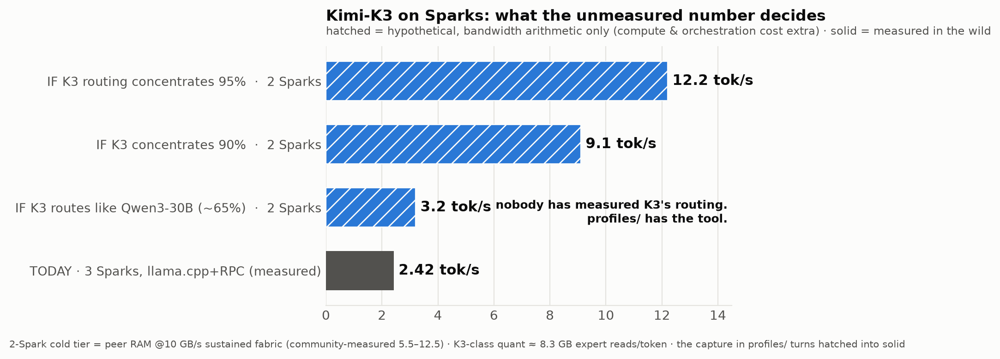

# Profile zoo — measured heat maps, ready to use

A profile is a routing heat map captured during **real generation** (decode
phase — the regime users actually run in; see `notes/e10`). With a profile,
`pollard-run` computes a measured expert placement for your VRAM budget in one
command — no capture needed on your side:

```bash
pollard-run --gguf <model.gguf> --profile <name> --vram auto --launch
```

Heat maps are model-specific, not transferable: on one MoE the deep layers run
hottest, on another the shallow ones — that's the whole reason measurement
beats blind placement (`--n-cpu-moe`). Each profile documents its capture:
corpus, tokens, sampling, date.

| profile | model | status |
|---|---|---|
| `qwen3-30b-a3b` | Qwen3-30B-A3B (128e/48L, top-8) | measured 2026-08-09 |

## Contributing a profile (~30-60 min on hardware that runs the model)

```bash
cd experiments && ./e2_build.sh
./e2_capture_routing -m model.gguf -f prompt.txt --gen 2000 --temp 0.8 -o trace.jsonl
python3 e2_analyse_routing.py --jsonl trace.jsonl --out heat.json
```

Use several long-form prompts (essay/code/story/task) and merge the traces —
see `experiments/README.md`. Open a PR with the heat json + capture details.

## 🏆 MOST WANTED: Kimi-K3

K3 heat cannot be captured on any single machine — it takes a cluster, which
means the only people who can produce this profile are the ones already
serving K3 over llama.cpp RPC (the DGX Spark multi-node setups). The capture
tool speaks the same RPC sharding:

```bash
# on each worker node:            rpc-server -p 50052
# on the head node:
./e2_capture_routing -m kimi-k3.gguf --rpc node2:50052,node3:50052 \
    -f task_prompt.txt --gen 2000 --temp 0.8 -o k3_trace.jsonl --ngl 999
```

A few thousand decode tokens of K3 routing would be a first — nobody has ever
published whether a 5.5T-parameter router concentrates. And the stakes are
visible: the curve below is pure bandwidth arithmetic — where K3 sits on the
x-axis decides everything, and only a capture can say.


